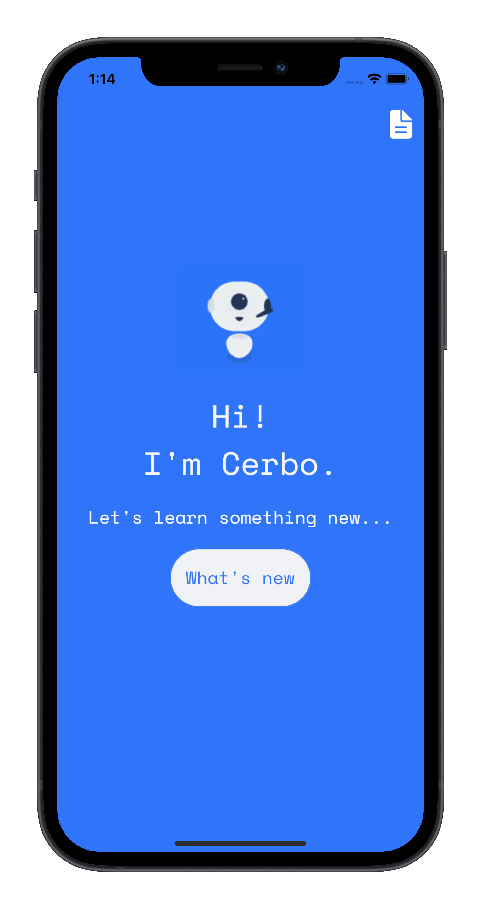

# Cerbo 2.0

An attempt to create a community driven general purpose Bot for developers.
- Get latest updates on Tech
- Answer common queries 
- Lookup code snippets 
- Assist in debugging (guess I'm getting delusion)

<table>
  <tr>
    <td></td>
    <td></td>
  </tr>
 </table>

## WIP
- Fetching latest stores from [Hacker News](https://github.com/HackerNews/API)

## Contribute
 Please contribute by adding features on the app or building integrations for the bot.
